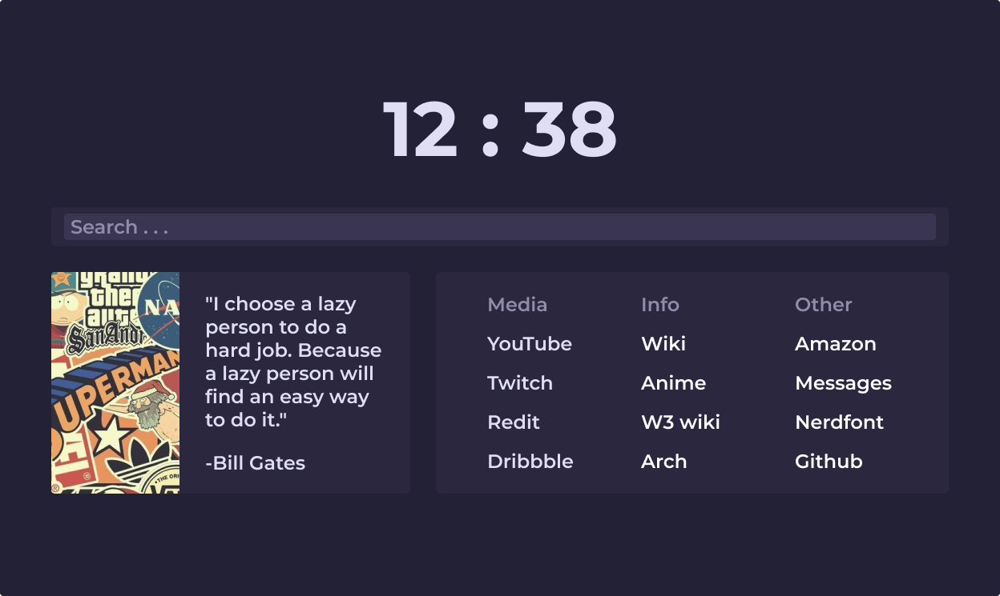

<h1 align="center">DUM NewTab</h1>

    a simple newtab page that looks good

    
    
    

------------------------
  
this is just a simple newtab page i made. this is a refined version of the lastone i made
moving some elements around and making stuff simpler and better. i can still improve this but 
sence it mainy for personal use now its probaly not gong to be soon or ever. either way 
thanks for taking a look at this.

to do 
* get clock working
* responsiveness

<h2>how to use</h2>

1. make a fork of this repository
2. go to settings then to pages and select the main branch and save
3. install the [new tab overide](https://addons.mozilla.org/en-US/firefox/addon/new-tab-override/) on Firefox or if you are on chrome or any chrmium based browser [Custom New Tab URL](https://chrome.google.com/webstore/detail/custom-new-tab-url/mmjbdbjnoablegbkcklggeknkfcjkjia)
4. open the extention and where it says to put the url put the url genrated from settings -> pages
5. enjoy

<h2>credits</h2>
[Rosé Pine](https://rosepinetheme.com) | i used this as a color theme